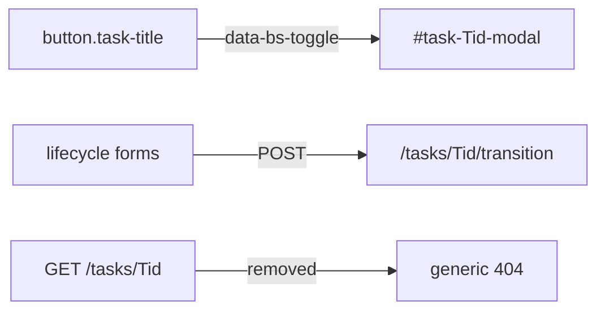

# Kanban Task Detail Modal

> **For agentic workers:** REQUIRED SUB-SKILL: Use superpowers:subagent-driven-development (recommended) or superpowers:executing-plans to implement this plan task-by-task. Steps use checkbox (`- [ ]`) syntax for tracking.

**Goal:** Clicking a card title on the Kanban Board opens that Task's canonical details in an accessible Tabler modal; `GET /tasks/<id>` is gone.

**Architecture:** Keep the stdlib loopback server (ADR 0007) and pinned Tabler assets (ADR 0008). Each board-visible Task gets its own modal HTML in the `GET /` response (no fetch, no extra JS, no hash URLs). Lifecycle forms stay on the cards. T016 will add editing later; this change is read-only. ADR 0009 records that the Kanban Board is the only HTML detail surface.

**Tech Stack:** Existing `KanbanWebApp` / `http.server`, Tabler Core 1.4.0 modal API (`data-bs-toggle` / `data-bs-dismiss`).

**Grilled decisions (locked):**

- Follow T015: the Kanban Board is the only HTML surface; archive lookup stays on CLI `show`.
- Lifecycle actions stay on cards.
- No bookmark/hash URL.
- Read-only definition list; do not scaffold T016's edit form.
- Title is `button.task-title` that opens the modal; actions remain siblings.
- Header X plus footer Close, both `data-bs-dismiss="modal"`.
- Markup tests only; no new browser design-qa pass.
- No CONTEXT.md change (Kanban Board already names this surface).
- ADR 0009 records the modal-only detail surface and the removal of `GET /tasks/{task_id}`.



## Files

- Modify: `src/bot_todo/web.py` — card trigger, per-task modal renderer, delete `render_task` and the `do_GET` detail branch.
- Modify: `tests/test_web.py` — modal assertions; `/tasks/<id>` is generic 404 even for known IDs.
- Modify: `.scratch/kanban-web-frontend/spec.md` — drop the detail-route bullet; document the modal as the only detail surface.
- Modify: `README.md` — one sentence that card titles open details in a modal.
- Create: `.scratch/kanban-web-frontend/t015-detail-modal-plan.md` (this plan).
- Create: `docs/adr/0009-kanban-task-detail-lives-in-a-board-modal.md`.

## Markup contract

Match `#add-task-modal` classes and dismiss attributes. Place every detail modal as a sibling of the add modal / board columns — **not** inside the card or the terminal `<details>` — so overflow clipping cannot hide the dialog.

Card title (today an `<a href="/tasks/...">`):

```html
<button type="button" class="task-title" data-bs-toggle="modal"
  data-bs-target="#task-T001-modal">
  <strong>T001</strong> Inspect details
</button>
```

Extend the existing `.task-title` rule so an unstyled `button` still looks like today's title link:

```css
.task-title{color:var(--tblr-primary);font-weight:600;border:0;background:transparent;padding:0;text-align:left;cursor:pointer}
```

Modal (one per board-visible Task, including overflow cards):

```html
<div class="modal modal-blur fade" id="task-T001-modal" tabindex="-1"
  aria-labelledby="task-T001-modal-title" aria-hidden="true">
  <div class="modal-dialog modal-lg modal-dialog-centered">
    <div class="modal-content">
      <div class="modal-header">
        <h2 class="modal-title" id="task-T001-modal-title">T001 — Inspect details</h2>
        <button type="button" class="btn-close" data-bs-dismiss="modal" aria-label="Close"></button>
      </div>
      <div class="modal-body">
        <dl class="row mb-0">...</dl>
      </div>
      <div class="modal-footer">
        <button type="button" class="btn btn-link" data-bs-dismiss="modal">Close</button>
      </div>
    </div>
  </div>
</div>
```

Reuse the current `render_task` field list (ID, Title, State, Priority, Type, Tags, Simple, Acceptance, Context, Related, Blocked by, Claim, Reviewed, Closed, Reason) with `—` for empty values. Drop the "Kanban Board" back link.

`render_board` already has the column task lists; concatenate `_render_task_detail_modal(task)` for every task in those lists (open, review, and all recent Done, including the ones behind `+ N more`). Format 1 read-only boards still get detail modals (they are not mutations).

Delete `KanbanWebApp.render_task`. In `KanbanRequestHandler.do_GET`, remove the `/tasks/<id>` branch so those paths fall through to `render_not_found()` — generic copy, no `RepositorySnapshot.find()`, no `"unknown task ID"` message. Keep `POST /tasks/<id>/transition`.

## Tests (TDD)

Replace page-oriented tests in `tests/test_web.py`:

- `test_task_page_shows_canonical_details` → GET `/`, assert `#task-{id}-modal`, `aria-labelledby`, header title id, field values, `data-bs-target` on `button.task-title`, footer Close, and `href="/tasks/{id}"` is absent.
- `test_every_html_surface_uses_the_shared_tabler_content_shell` → drop the successful GET `/tasks/{id}`; keep GET `/tasks/T999` as a 404 shell check.
- `test_unknown_task_returns_a_human_404` → GET `/tasks/T999` is 404 with `"The requested page does not exist"` and without `"unknown task ID"` / traceback.
- Add: GET `/tasks/{existing_id}` is the same generic 404 (route gone, not a lookup miss).
- Delete `test_detail_route_finds_a_task_retired_to_the_archive`. Add a lock-in: after pushing a Task into the archive (same 20-complete setup), GET `/` does not contain that title, and GET `/tasks/{archived_id}` is 404.
- Assert lifecycle `action="/tasks/{id}/transition"` still appears on the card, not inside the modal.

Run: `make pytest ARGS="tests/test_web.py -q"` after the failing tests, then after implementation.

## Docs and task metadata

Update `.scratch/kanban-web-frontend/spec.md` HTTP interface:

- Remove `GET /tasks/{task_id}` / archive-addressable page.
- State that each board-visible card title opens a server-rendered Tabler modal with canonical fields; `GET /tasks/{task_id}` returns the generic 404 page.
- Keep `POST /tasks` and `POST /tasks/{task_id}/transition`.

README Local Kanban Board: card titles open details in a modal; full-archive lookup remains CLI-only (already implied).

Link this plan and ADR 0009 from T015 via `bot-todo`. Do not hand-edit `TODO.md`.

## Quality gate

Touched Python: `ruff`, `mypy`, `make napoleon-gate`, then `make pytest`. Move T015 to review when gates pass. Do not complete T015 in this change.

## Execution notes

- Claim T015 before coding.
- No new Python dependency, no custom JS, no CSP change.
- Do not invent a new class; add `_render_task_detail_modal` on `KanbanWebApp` next to `_render_add_form`.
- Leave T016's edit form unbuilt.
