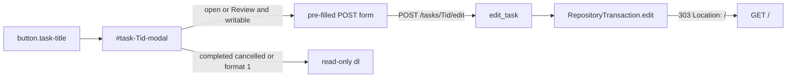

# Kanban Task Detail Modal Edits

> **For agentic workers:** REQUIRED SUB-SKILL: Use superpowers:subagent-driven-development (recommended) or superpowers:executing-plans to implement this plan task-by-task. Steps use checkbox (`- [ ]`) syntax for tracking.

**Goal:** Open and Review tasks can be edited in the existing Kanban detail modal through `RepositoryTransaction.edit`; completed and cancelled tasks stay read-only.

**Architecture:** Keep the stdlib loopback server (ADR 0007) and pinned Tabler assets (ADR 0008). The T015 detail modal stays the only HTML detail surface (ADR 0009). For writable open/Review tasks, replace the definition list with a pre-filled form that POSTs to `/tasks/{id}/edit`. `KanbanWebApp.edit_task` maps that full-replace form onto `transaction.edit`. No second mutation path, no restored standalone page, no fetch, no custom JS.

**Tech Stack:** Existing `KanbanWebApp` / `http.server`, Tabler Core 1.4.0 modal API (`data-bs-toggle` / `data-bs-dismiss`).

**Grilled decisions (locked):**

- Always-form for open and Review on a writable board; completed/cancelled keep today's read-only `dl`.
- Format 1 boards stay mutation-free (same `writable` gate as add/lifecycle); open tasks there keep the read-only `dl`.
- `POST /tasks/{id}/edit`. GET of that path stays the generic 404.
- Submitted values are the intended full state of editable fields. Empty Context, Related, Tags, and Blockers clear them.
- Tags are one comma-separated user-tag field, diffed into `add_tags`/`remove_tags`. Type select owns type. Simple checkbox owns `#simple`. A type tag or `simple` in Tags is 400 usage (do not strip).
- Acceptance XOR simple matches `add_task`: both → 400; neither → 400; Simple + empty Acceptance → `clear_acceptance=True`; Acceptance + unchecked Simple → set acceptance.
- Read-only above the form: ID, State, Claim, Reviewed. Claims stay CLI-only.
- Reuse add layout. Open Advanced when any of Tags, Context, Related, or Blockers is already set. Footer: Cancel + Save. Closed modals keep Close only.
- No-op Save is allowed (303 to `/`). CLI "at least one change" is CLI-only.
- Do not add fetch or custom JS in T016 (YAGNI). Do not write a standing ban. CSP unchanged.
- Errors stay concise HTML error pages. Do not reopen the modal.
- Markup + HTTP tests in `tests/test_web.py` only. No new browser design-qa pass.
- No `CONTEXT.md` change.
- ADR 0010 records the full-replace form mapped onto `RepositoryTransaction.edit`.



## Files

- Modify: `src/bot_todo/web.py` — writable open/Review modal becomes an edit form; add `edit_task`; route `POST /tasks/{id}/edit`; share priority/type option markup with the add form.
- Modify: `tests/test_web.py` — edit-form markup, successful POST, closed-task rejection, plus the grilled cases below.
- Modify: `.scratch/kanban-web-frontend/spec.md` — document `POST /tasks/{id}/edit`; stop listing task editing as a T010-only exclusion of this board.
- Modify: `README.md` — the board can edit Open and Review tasks in the detail modal.
- Create: `.scratch/kanban-web-frontend/t016-edit-modal-plan.md` (this plan).
- Create: `docs/adr/0010-edit-open-and-review-tasks-in-the-kanban-detail-modal.md`.

Do not invent a new class. Add `edit_task` on `KanbanWebApp` next to `add_task`. Pass `writable` into `_render_task_detail_modal`.

---

### Task 1: Failing web tests

**Files:**
- Modify: `tests/test_web.py`

The current `test_board_shows_canonical_details_in_a_tabler_modal` asserts a Close footer and definition-list values on an **open** task. That modal becomes a form. Update that test to the edit-form contract, and add the POST and rejection cases T016 requires.

- [ ] **Step 1: Rewrite the open-task modal test into an edit-form markup test**

Replace `test_board_shows_canonical_details_in_a_tabler_modal` so an open task with tags, acceptance, context, related, and a claim renders the form (not Close, not a title `dd`):

```python
    def test_board_shows_canonical_details_in_a_tabler_modal(self) -> None:
        """Catch a board that omits persisted task fields or restores a detail page."""
        with self.store.transaction() as transaction:
            task = transaction.add(
                title="Inspect details",
                priority="P1",
                task_type="feature",
                tags=["browser"],
                acceptance="Every field is visible",
                context="Local operator",
                related="T009",
            )
            transaction.claim(task.task_id, "tester", "test-branch")

        status, _, body = self.get("/")

        self.assertEqual(status, 200)
        modal_id = f"task-{task.task_id}-modal"
        title_id = f"{modal_id}-title"
        self.assertIn(
            f'<button type="button" class="task-title" data-bs-toggle="modal" '
            f'data-bs-target="#{modal_id}">',
            body,
        )
        self.assertNotIn(f'href="/tasks/{task.task_id}"', body)
        modal = self._task_modal(body, task.task_id)
        self.assertIn(f'class="modal modal-blur fade" id="{modal_id}"', modal)
        self.assertIn(f'aria-labelledby="{title_id}"', modal)
        self.assertIn(f'id="{title_id}"', modal)
        self.assertIn(f"{task.task_id} — Inspect details", modal)
        self.assertIn(f'action="/tasks/{task.task_id}/edit"', modal)
        self.assertIn('name="title" value="Inspect details"', modal)
        self.assertIn('<option value="P1" selected>', modal)
        self.assertIn('<option value="feature" selected>', modal)
        self.assertIn("Every field is visible", modal)
        self.assertIn('name="tags" value="browser"', modal)
        self.assertIn("Local operator", modal)
        self.assertIn('name="related" value="T009"', modal)
        self.assertIn("<details class=\"mt-3\" open>", modal)
        self.assertIn("tester | ", modal)
        self.assertIn(
            '<button type="button" class="btn btn-link" data-bs-dismiss="modal">'
            "Cancel</button>",
            modal,
        )
        self.assertIn('type="submit">Save</button>', modal)
        self.assertNotIn(">Close</button>", modal)
        self.assertNotIn(f'action="/tasks/{task.task_id}/transition"', modal)
        self.assertIn(f'action="/tasks/{task.task_id}/transition"', body)
```

If the exact `name="title" value="Inspect details"` attribute order does not match the renderer, assert the substring the renderer actually emits (`value="Inspect details"` inside the title label). Keep Cancel + Save, no Close, no lifecycle form inside the modal.

- [ ] **Step 2: Add closed-task, Review, POST, and rejection tests**

Append to `KanbanWebTests`:

```python
    def test_closed_task_detail_modal_stays_read_only(self) -> None:
        """Catch an edit form appearing on a completed or cancelled task."""
        with self.store.transaction() as transaction:
            completed = transaction.add(
                title="Finished work",
                priority="P2",
                task_type="chore",
                simple=True,
            )
            cancelled = transaction.add(
                title="Stopped work",
                priority="P2",
                task_type="docs",
                simple=True,
            )
            transaction.close(completed.task_id, "completed")
            transaction.close(cancelled.task_id, "cancelled", "No longer needed")

        _, _, body = self.get("/")

        for task_id, title in (
            (completed.task_id, "Finished work"),
            (cancelled.task_id, "Stopped work"),
        ):
            modal = self._task_modal(body, task_id)
            self.assertNotIn(f'action="/tasks/{task_id}/edit"', modal)
            self.assertIn(
                '<button type="button" class="btn btn-link" data-bs-dismiss="modal">'
                "Close</button>",
                modal,
            )
            self.assertIn(title, modal)

    def test_review_task_detail_modal_is_editable(self) -> None:
        """Catch Review tasks left on the read-only definition list."""
        with self.store.transaction() as transaction:
            task = transaction.add(
                title="Needs review",
                priority="P1",
                task_type="feature",
                simple=True,
            )
            transaction.review(task.task_id)

        _, _, body = self.get("/")
        modal = self._task_modal(body, task.task_id)
        self.assertIn(f'action="/tasks/{task.task_id}/edit"', modal)
        self.assertIn('name="simple" checked', modal)

    def test_edit_form_persists_required_and_advanced_fields(self) -> None:
        """Catch an edit POST that drops fields or skips RepositoryTransaction.edit."""
        with self.store.transaction() as transaction:
            blocker = transaction.add(
                title="Blocker",
                priority="P2",
                task_type="chore",
                simple=True,
            )
            task = transaction.add(
                title="Original title",
                priority="P2",
                task_type="chore",
                tags=["old"],
                acceptance="Old acceptance",
                context="Old context",
                related="old-related",
                blocked_by=[blocker.task_id],
            )

        status, headers, _ = self.post(
            f"/tasks/{task.task_id}/edit",
            {
                "title": "Edited in browser",
                "priority": "P1",
                "task_type": "feature",
                "acceptance": "New acceptance",
                "tags": "browser, local",
                "context": "New context",
                "related": "T015",
                "blocked_by": "",
            },
        )

        edited = self.store.snapshot().find(task.task_id)
        self.assertEqual(status, 303)
        self.assertEqual(headers["Location"], "/")
        self.assertEqual(edited.title, "Edited in browser")
        self.assertEqual(edited.priority, "P1")
        self.assertEqual(edited.task_type, "feature")
        self.assertEqual(edited.user_tags, ["browser", "local"])
        self.assertEqual(edited.acceptance, "New acceptance")
        self.assertFalse(edited.simple)
        self.assertEqual(edited.context, "New context")
        self.assertEqual(edited.related, "T015")
        self.assertEqual(edited.blocked_by, [])
        _, _, body = self.get("/")
        self.assertIn("Edited in browser", body)

    def test_edit_form_noop_save_redirects_to_the_board(self) -> None:
        """Catch a no-change Save treated as a CLI-style usage error."""
        with self.store.transaction() as transaction:
            task = transaction.add(
                title="Unchanged",
                priority="P2",
                task_type="chore",
                simple=True,
            )

        status, headers, _ = self.post(
            f"/tasks/{task.task_id}/edit",
            {
                "title": "Unchanged",
                "priority": "P2",
                "task_type": "chore",
                "simple": "on",
                "tags": "",
                "context": "",
                "related": "",
                "blocked_by": "",
            },
        )

        self.assertEqual(status, 303)
        self.assertEqual(headers["Location"], "/")
        self.assertEqual(self.store.snapshot().find(task.task_id).title, "Unchanged")

    def test_edit_rejects_closed_tasks(self) -> None:
        """Catch an edit POST that mutates a completed or cancelled task."""
        with self.store.transaction() as transaction:
            task = transaction.add(
                title="Done already",
                priority="P2",
                task_type="chore",
                simple=True,
            )
            transaction.close(task.task_id, "completed")

        status, _, body = self.post(
            f"/tasks/{task.task_id}/edit",
            {
                "title": "Should not stick",
                "priority": "P2",
                "task_type": "chore",
                "simple": "on",
            },
        )

        self.assertEqual(status, 409)
        self.assertIn("closed tasks cannot be edited", body)
        self.assertEqual(self.store.snapshot().find(task.task_id).title, "Done already")

    def test_edit_rejects_acceptance_together_with_simple(self) -> None:
        """Catch both Acceptance and Simple submitted on an edit."""
        with self.store.transaction() as transaction:
            task = transaction.add(
                title="Exclusive fields",
                priority="P2",
                task_type="chore",
                simple=True,
            )

        status, _, body = self.post(
            f"/tasks/{task.task_id}/edit",
            {
                "title": "Exclusive fields",
                "priority": "P2",
                "task_type": "chore",
                "acceptance": "Done when complete",
                "simple": "on",
            },
        )

        self.assertEqual(status, 400)
        self.assertTrue(self.store.snapshot().find(task.task_id).simple)

    def test_edit_rejects_neither_acceptance_nor_simple(self) -> None:
        """Catch an edit that would drop both Acceptance and #simple."""
        with self.store.transaction() as transaction:
            task = transaction.add(
                title="Needs one",
                priority="P2",
                task_type="chore",
                acceptance="Keep me or mark simple",
            )

        status, _, body = self.post(
            f"/tasks/{task.task_id}/edit",
            {
                "title": "Needs one",
                "priority": "P2",
                "task_type": "chore",
                "acceptance": "",
            },
        )

        self.assertEqual(status, 400)
        self.assertEqual(
            self.store.snapshot().find(task.task_id).acceptance,
            "Keep me or mark simple",
        )

    def test_edit_rejects_reserved_words_in_tags(self) -> None:
        """Catch type or simple leaking into the Tags field."""
        with self.store.transaction() as transaction:
            task = transaction.add(
                title="Reserved tags",
                priority="P2",
                task_type="chore",
                tags=["browser"],
                simple=True,
            )

        for tags in ("browser, feature", "browser, simple", "browser, #bug"):
            with self.subTest(tags=tags):
                status, _, body = self.post(
                    f"/tasks/{task.task_id}/edit",
                    {
                        "title": "Reserved tags",
                        "priority": "P2",
                        "task_type": "chore",
                        "simple": "on",
                        "tags": tags,
                    },
                )
                self.assertEqual(status, 400)
        self.assertEqual(
            self.store.snapshot().find(task.task_id).user_tags, ["browser"]
        )

    def test_edit_unknown_task_returns_not_found(self) -> None:
        """Catch POST /tasks/<id>/edit treating a missing id as a generic 404."""
        status, _, body = self.post(
            "/tasks/T999/edit",
            {
                "title": "Missing",
                "priority": "P2",
                "task_type": "chore",
                "simple": "on",
            },
        )

        self.assertEqual(status, 404)
        self.assertIn("The requested page does not exist", body)

    def test_get_edit_path_returns_generic_not_found(self) -> None:
        """Catch a standalone GET edit page."""
        with self.store.transaction() as transaction:
            task = transaction.add(
                title="No get edit",
                priority="P2",
                task_type="chore",
                simple=True,
            )

        status, _, body = self.get(f"/tasks/{task.task_id}/edit")

        self.assertEqual(status, 404)
        self.assertIn("The requested page does not exist", body)
```

Also extend `test_format_one_repository_is_browsable_but_read_only` if needed: it already asserts `assertNotIn("<form", body)`. Keep that. Writable gating must make Format 1 open-task modals stay a `dl`.

A simple open task with empty advanced fields must **not** emit `<details class="mt-3" open>`. Cover that in the Review or no-op fixture (`simple=True`, no tags/context/related/blockers) by asserting `'<details class="mt-3">'` without `open`.

- [ ] **Step 3: Run the focused tests and confirm they fail**

Run: `make pytest ARGS="tests/test_web.py -q"`

Expected: FAIL — missing `/edit` action, Save footer, `edit_task`, and the new POST route.

---

### Task 2: Minimal implementation

**Files:**
- Modify: `src/bot_todo/web.py`

- [ ] **Step 4: Import `SIMPLE_TAG` and share select markup**

Add `SIMPLE_TAG` to the `bot_todo.repository` import. Extract option helpers used by both add and edit:

```python
    def _priority_options(self, selected: str) -> str:
        """Render priority ``<option>`` elements.

        Args:
            selected: Priority key marked ``selected``.

        Returns:
            Escaped option markup.
        """
        return "".join(
            f'<option value="{html.escape(priority)}"'
            f"{' selected' if priority == selected else ''}>"
            f"{html.escape(priority)}</option>"
            for priority in PRIORITY_HEADINGS
        )

    def _type_options(self, selected: str | None) -> str:
        """Render type ``<option>`` elements.

        Args:
            selected: Type tag marked ``selected``, if any.

        Returns:
            Escaped option markup.
        """
        return "".join(
            f'<option value="{html.escape(task_type)}"'
            f"{' selected' if task_type == selected else ''}>"
            f"{html.escape(task_type)}</option>"
            for task_type in sorted(TYPE_TAGS)
        )
```

In `_render_add_form`, replace the local `priorities` / `task_types` loops with `self._priority_options("P2")` and `self._type_options(None)`.

- [ ] **Step 5: Add `edit_task` beside `add_task`**

```python
    def edit_task(self, task_id: str, fields: dict[str, str]) -> Task:
        """Replace editable fields on one open or review task.

        Side Effects:
            Mutates the selected Task Repository.

        Args:
            task_id: Task receiving the edit.
            fields: Parsed URL-encoded form fields.

        Returns:
            Updated task.

        Raises:
            TodoError: If form values violate the edit contract or the task
                is closed.
        """
        priority = fields.get("priority", "")
        task_type = fields.get("task_type", "")
        if priority not in PRIORITY_HEADINGS:
            raise TodoError("unknown priority", "usage")
        if task_type not in TYPE_TAGS:
            raise TodoError("unknown task type", "usage")
        acceptance = fields.get("acceptance") or None
        simple = fields.get("simple") == "on"
        if acceptance and simple:
            raise TodoError("choose acceptance or simple, not both", "usage")
        if not acceptance and not simple:
            raise TodoError("choose acceptance or simple", "usage")
        tags = [value.strip() for value in fields.get("tags", "").split(",")]
        submitted = [value for value in tags if value]
        reserved = TYPE_TAGS | {SIMPLE_TAG}
        if any(value.removeprefix("#") in reserved for value in submitted):
            raise TodoError("use type and simple controls, not tags", "usage")
        blockers = [
            value.strip()
            for value in fields.get("blocked_by", "").split(",")
            if value.strip()
        ]
        current = self.store.snapshot().find(task_id)
        current_tags = list(current.user_tags) if current is not None else []
        add_tags = [tag for tag in submitted if tag not in current_tags]
        remove_tags = [tag for tag in current_tags if tag not in submitted]
        context = fields.get("context") or None
        related = fields.get("related") or None
        with self.store.transaction() as transaction:
            return transaction.edit(
                task_id,
                title=fields.get("title", ""),
                priority=priority,
                task_type=task_type,
                add_tags=add_tags,
                remove_tags=remove_tags,
                acceptance=None if simple else acceptance,
                context=context,
                related=related,
                blocked_by=blockers,
                clear_acceptance=simple,
                clear_context=not context,
                clear_related=not related,
            )
```

Empty `blocked_by` is `[]`, which `edit()` treats as clear. Do not pass `None`.

- [ ] **Step 6: Render the edit form for writable open/Review tasks**

Change `render_board` to pass `writable`:

```python
        detail_modals = "".join(
            self._render_task_detail_modal(task, writable=writable)
            for _, tasks in columns
            for task in tasks
        )
```

Keep today's definition-list modal when `writable` is false or `task.state` is `completed` or `cancelled`. Otherwise wrap a form around a short read-only `dl` (ID, State, Claim, Reviewed) plus the add-form fields, pre-filled.

Sketch for the editable branch (escape every value; match `#add-task-modal` classes and dismiss attributes):

```html
<div class="modal modal-blur fade" id="task-T001-modal" tabindex="-1"
  aria-labelledby="task-T001-modal-title" aria-hidden="true">
  <div class="modal-dialog modal-lg modal-dialog-centered">
    <div class="modal-content">
      <div class="modal-header">
        <h2 class="modal-title" id="task-T001-modal-title">T001 — Inspect details</h2>
        <button type="button" class="btn-close" data-bs-dismiss="modal" aria-label="Close"></button>
      </div>
      <form method="post" action="/tasks/T001/edit">
        CSRF field
        <div class="modal-body">
          <dl class="row">ID, State, Claim, Reviewed with — for empty</dl>
          Title input required, value=current title
          Priority + Type selects with current selected
          Acceptance textarea
          Simple checkbox, checked when task.simple
          <details class="mt-3" open?> Advanced: tags, context, related, blocked_by
        </div>
        <div class="modal-footer">
          <button type="button" class="btn btn-link" data-bs-dismiss="modal">Cancel</button>
          <button class="btn btn-primary" type="submit">Save</button>
        </div>
      </form>
    </div>
  </div>
</div>
```

Open Advanced when any of `task.user_tags`, `task.context`, `task.related`, or `task.blocked_by` is non-empty: emit `<details class="mt-3" open>`. Otherwise `<details class="mt-3">`.

Simple checkbox: `checked` only when `task.simple`. Prefer `name="simple" checked` (boolean attribute) so the Review test matches. Title field: keep the add-form label wrapper; include `value="..."` on the input.

Claim display stays `actor | claimed_on | branch` when present, else `—`. Do not add claim controls.

- [ ] **Step 7: Route `POST /tasks/{id}/edit`**

In `KanbanRequestHandler.do_POST`, replace the transition-only branch:

```python
            if path == "/tasks":
                self.app.add_task(fields)
            else:
                parts = path.split("/")
                if (
                    len(parts) != 4
                    or parts[1] != "tasks"
                    or parts[3] not in {"transition", "edit"}
                ):
                    self._send_html(404, self.app.render_not_found())
                    return
                task_id = unquote(parts[2])
                if parts[3] == "edit":
                    self.app.edit_task(task_id, fields)
                else:
                    self.app.transition_task(task_id, fields)
```

Leave `do_GET` unchanged so `GET /tasks/{id}/edit` stays the generic 404.

- [ ] **Step 8: Re-run the focused tests until they pass**

Run: `make pytest ARGS="tests/test_web.py -q"`

Expected: PASS.

If a markup assertion fails on attribute order (`checked` vs `value=`), change the renderer to the order the test names, not the other way around, unless the test assumed illegal HTML.

---

### Task 3: Spec, README, and quality gate

**Files:**
- Modify: `.scratch/kanban-web-frontend/spec.md`
- Modify: `README.md`

- [ ] **Step 9: Update the kanban spec HTTP interface**

In `.scratch/kanban-web-frontend/spec.md`:

- After the transition bullet, add: `POST /tasks/{task_id}/edit` maps the detail-modal form onto `RepositoryTransaction.edit()` for open and Review tasks. Empty Context, Related, Tags, and Blockers clear those fields. Completed and cancelled tasks have no edit form.
- In Presentation, state that open and Review detail modals on a writable board are the edit form (read-only ID/State/Claim/Reviewed above the fields); completed and cancelled stay a read-only definition list.
- Change Exclusions so **task editing is no longer listed as outside this board**. Keep claims, full archive listing, polling, WebSockets, JSON API, drag-and-drop, authentication, non-loopback binding, and multi-repository boards outside scope. Phrase the leftover T010 exclusions so they are not "everything T010 deferred," because editing has moved to T016.

- [ ] **Step 10: Update the README Kanban paragraph**

In `README.md` Local Kanban Board, replace the sentence that says task editing remains CLI-only. The board can add tasks, edit Open and Review tasks in the detail modal, move Open work to Review, reopen Review work, and complete or cancel Open or Review work. Claims, full-archive browsing, and multi-repository boards remain CLI-only.

- [ ] **Step 11: Quality gate**

Touched Python: `ruff` and `mypy` on `src/bot_todo/web.py` and `tests/test_web.py`. Then `make napoleon-gate`, then `make pytest`.

Move T016 to Review after every gate passes. Do not complete T016 in this change. T015 must be completed before T016 is actionable; if it is still in Review, leave the blocker in place.

## Execution notes

- T015 is the blocker. Do not start coding T016 until T015 is completed, unless the person explicitly unblocks it.
- Claim T016 before coding.
- No new Python dependency, no custom JS, no CSP change, no `CONTEXT.md` change.
- Do not invent a new class.
- Do not restore `GET /tasks/{id}` or `render_task`.
