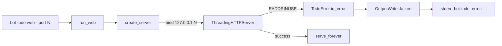

# Occupied Kanban Port Failure

> **For agentic workers:** REQUIRED SUB-SKILL: Use superpowers:subagent-driven-development (recommended) or superpowers:executing-plans to implement this plan task-by-task. Steps use checkbox (`- [ ]`) syntax for tracking.

**Goal:** `bot-todo web` on an occupied loopback port exits 1 with a coded human error that names the port, says the Kanban Board could not bind, and tells the user to retry with `--port` / `--port 0` — no traceback and no raw `OSError`.

**Architecture:** Keep the stdlib loopback server (ADR 0007). Catch `errno.EADDRINUSE` (and Windows `WSAEADDRINUSE` when present) in `KanbanWebApp.create_server`, the only bind site, and raise `TodoError(..., "io_error")`. Existing CLI `except TodoError` already prints `bot-todo: error: ...` and exits 1. Do not auto-rebind, do not add an error code, do not change `HTTPServer.allow_reuse_address`.

**Tech Stack:** Existing `KanbanWebApp` / `ThreadingHTTPServer`, `errno`, `TodoError`.



**Locked decisions:**

- Fail; do not pick another port.
- Convert only address-in-use at `create_server`. Other bind `OSError`s still reach CLI's generic `io_error` wrapper.
- Keep code `io_error` (web rejects `--json`; no new public code).
- Exact message: `Kanban Board could not bind 127.0.0.1:{port} because that port is already in use. Retry with --port PORT, or --port 0 to let the OS choose a free port.`
- Occupy-port tests must `bind` + `listen` without `SO_REUSEADDR`.
- No ADR, no `CONTEXT.md` change.
- One-sentence README + spec updates only.

## Files

- Modify: `src/bot_todo/web.py` — import `errno`; wrap in-use bind in `create_server`; document `TodoError` in `Raises:`.
- Modify: `tests/test_web.py` — real occupied-port `create_server` test; non-EADDRINUSE still propagates.
- Modify: `tests/test_cli.py` — `web --port N --no-open` on an occupied port: exit 1, no traceback, required phrases.
- Modify: `.scratch/kanban-web-frontend/spec.md` — occupied requested port is a coded CLI failure; no auto-rebind.
- Modify: `README.md` — one sentence after the `--port 0` sentence.
- Create: `.scratch/kanban-web-frontend/t017-port-in-use-plan.md` (this plan).

`run_web` and `src/bot_todo/cli.py` stay unchanged: `create_server` raises before `serve_forever`, and `main` already maps `TodoError` to stderr + exit 1.

---

### Task 1: Failing tests

**Files:**
- Modify: `tests/test_web.py`
- Modify: `tests/test_cli.py`

- [ ] **Step 1: Add occupied-port tests in `tests/test_web.py`**

Import `errno` and `socket` at the top of `tests/test_web.py`. Add these methods on `KanbanWebTests` (the class already starts an ephemeral server in `setUp`; these extra binds use a different port):

```python
    def test_create_server_reports_an_occupied_port(self) -> None:
        """Catch a raw OSError when the requested loopback port is already bound."""
        holder = socket.socket(socket.AF_INET, socket.SOCK_STREAM)
        try:
            holder.bind(("127.0.0.1", 0))
            holder.listen(1)
            port = holder.getsockname()[1]
            with self.assertRaises(TodoError) as raised:
                self.app.create_server(port)
        finally:
            holder.close()

        error = raised.exception
        self.assertEqual(error.code, "io_error")
        self.assertEqual(
            str(error),
            (
                f"Kanban Board could not bind 127.0.0.1:{port} because that "
                "port is already in use. Retry with --port PORT, or --port 0 "
                "to let the OS choose a free port."
            ),
        )
        self.assertNotIn("Traceback", str(error))
        self.assertNotIn("OSError", str(error))

    def test_create_server_does_not_rewrite_other_bind_errors(self) -> None:
        """Catch EADDRINUSE handling that swallows unrelated bind failures."""
        with mock.patch(
            "bot_todo.web.ThreadingHTTPServer",
            side_effect=OSError(errno.EACCES, "Permission denied"),
        ):
            with self.assertRaises(OSError) as raised:
                self.app.create_server(80)

        self.assertEqual(raised.exception.errno, errno.EACCES)
```

Also add `TodoError` to the existing `bot_todo.repository` import in `tests/test_web.py` (today it imports `TodoStore` only).

- [ ] **Step 2: Add the CLI occupied-port test in `tests/test_cli.py`**

Import `socket` at the top of `tests/test_cli.py`. Add to `WebCommandTests`:

```python
    def test_web_reports_an_occupied_port_without_a_traceback(self) -> None:
        """Catch an occupied --port surfacing as a raw OSError or traceback."""
        holder = socket.socket(socket.AF_INET, socket.SOCK_STREAM)
        try:
            holder.bind(("127.0.0.1", 0))
            holder.listen(1)
            port = str(holder.getsockname()[1])
            result = self.run_cli(
                "web", "--port", port, "--no-open", check=False
            )
        finally:
            holder.close()

        self.assertEqual(result.returncode, 1)
        self.assertEqual(result.stdout, "")
        self.assertNotIn("Traceback", result.stderr)
        self.assertNotIn("OSError", result.stderr)
        self.assertNotIn("Address already in use", result.stderr)
        self.assertIn(f"127.0.0.1:{port}", result.stderr)
        self.assertIn("Kanban Board could not bind", result.stderr)
        self.assertIn("already in use", result.stderr)
        self.assertIn("--port PORT", result.stderr)
        self.assertIn("--port 0", result.stderr)
```

This invocation cannot hang: `create_server` must raise before `serve_forever`. If bind unexpectedly succeeds, the test will hang — that means the occupy fixture is wrong (do not set `SO_REUSEADDR` on the holder).

- [ ] **Step 3: Run the new tests and confirm they fail**

Run: `make pytest ARGS="tests/test_web.py::KanbanWebTests::test_create_server_reports_an_occupied_port tests/test_web.py::KanbanWebTests::test_create_server_does_not_rewrite_other_bind_errors tests/test_cli.py::WebCommandTests::test_web_reports_an_occupied_port_without_a_traceback -q"`

Expected: FAIL — `create_server` still raises `OSError`, CLI stderr still contains `Address already in use` / `[Errno …]`.

---

### Task 2: Map EADDRINUSE in `create_server`

**Files:**
- Modify: `src/bot_todo/web.py`

- [ ] **Step 1: Wrap address-in-use at the bind site**

Add `import errno` next to the other stdlib imports.

Replace `KanbanWebApp.create_server` so a successful bind is unchanged, and only in-use failures become `TodoError`. Update `Raises:` to include `TodoError`:

```python
    def create_server(self, port: int) -> ThreadingHTTPServer:
        """Bind an HTTP server to loopback.

        Args:
            port: Requested TCP port; zero asks the operating system to choose.

        Returns:
            Bound server ready for ``serve_forever``.

        Raises:
            ValueError: If the port is outside the TCP port range.
            TodoError: If the requested loopback port is already in use.

        Side Effects:
            Binds a loopback TCP socket.
        """
        if not 0 <= port <= 65535:
            raise ValueError("port must be between 0 and 65535")
        handler = partial(KanbanRequestHandler, app=self)
        try:
            server = ThreadingHTTPServer(("127.0.0.1", port), handler)
        except OSError as error:
            in_use = {errno.EADDRINUSE}
            winsock_in_use = getattr(errno, "WSAEADDRINUSE", None)
            if winsock_in_use is not None:
                in_use.add(winsock_in_use)
            if error.errno not in in_use:
                raise
            raise TodoError(
                (
                    f"Kanban Board could not bind 127.0.0.1:{port} because that "
                    "port is already in use. Retry with --port PORT, or --port 0 "
                    "to let the OS choose a free port."
                ),
                "io_error",
            ) from error
        server.daemon_threads = True
        self.origin = f"http://127.0.0.1:{server.server_port}"
        return server
```

`TodoError` is already imported from `bot_todo.repository`. Leave `run_web` as-is.

- [ ] **Step 2: Re-run the focused tests until they pass**

Run: `make pytest ARGS="tests/test_web.py::KanbanWebTests::test_create_server_reports_an_occupied_port tests/test_web.py::KanbanWebTests::test_create_server_does_not_rewrite_other_bind_errors tests/test_cli.py::WebCommandTests::test_web_reports_an_occupied_port_without_a_traceback tests/test_web.py::KanbanWebTests::test_run_web_prints_and_opens_the_actual_bound_url tests/test_cli.py::WebCommandTests -q"`

Expected: PASS.

- [ ] **Step 3: Commit (when the implementer is asked to commit)**

```bash
git add src/bot_todo/web.py tests/test_web.py tests/test_cli.py
git commit -m "$(cat <<'EOF'
fix: report an occupied Kanban --port without a raw OSError

EOF
)"
```

---

### Task 3: Docs, link, quality gate

**Files:**
- Modify: `.scratch/kanban-web-frontend/spec.md`
- Modify: `README.md`

- [ ] **Step 1: Document the bind failure**

In `.scratch/kanban-web-frontend/spec.md` Command section, after the sentence about port `0`, add:

`An occupied requested port is a coded CLI failure that names 127.0.0.1 and the port, explains that the Kanban Board could not bind, and tells the user to retry with --port (including --port 0). The server does not choose another port.`

In `README.md` Local Kanban Board section, after "port `0` asks the operating system to choose an available port.", add:

`If that port is already in use, the command exits with an error naming 127.0.0.1 and the port and suggests retrying with --port PORT or --port 0.`

- [ ] **Step 2: Link the plan from T017**

```bash
bot-todo --json --root . validate
bot-todo --json --root . claim T017 --actor cursor
bot-todo --json --root . edit T017 --context "create_server binds ThreadingHTTPServer to 127.0.0.1; default --port is 8765. An occupied port currently surfaces as a generic OSError ('Address already in use') wrapped as io_error by the CLI, with no mention of the requested port or --port. Related: T010. ADR: docs/adr/0007-serve-the-local-kanban-with-the-python-standard-library.md Plan: .scratch/kanban-web-frontend/t017-port-in-use-plan.md"
bot-todo --json --root . validate
```

(The claim/link happens when this plan file is written; do not hand-edit `TODO.md`.)

- [ ] **Step 3: Quality gate**

```bash
ruff check src/bot_todo/web.py tests/test_web.py tests/test_cli.py
mypy src/bot_todo/web.py tests/test_web.py tests/test_cli.py
make napoleon-gate
make pytest ARGS="tests/test_web.py tests/test_cli.py::WebCommandTests -q"
```

Fix everything those runs report before moving T017 to Review.

---

**Spec coverage:** Occupied port, no traceback/raw OSError, named port, Kanban Board could not bind, retry with `--port` including `--port 0`, tests on the occupied-port path — Task 1–2. Docs — Task 3. Out of scope: auto-rebind, new error code, ADR, `CONTEXT.md`, privileged-port (`EACCES`) copy.

**Placeholder scan:** none. **Type consistency:** `TodoError` / `io_error` / `create_server(port: int)` match current code.
